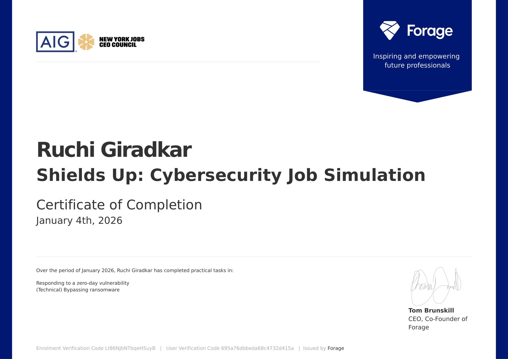

# AIG Shields Up Cybersecurity Job Simulation

## Author
Ruchi Giradkar  
Security Operations | Incident Response | Vulnerability Management | Threat Analysis

---

## Overview

This repository documents my completed work for the AIG Shields Up Cybersecurity Virtual Experience Program delivered via Forage in January 2026. The simulation mirrors real world responsibilities of an Information Security Analyst operating within an enterprise Cyber and Information Security team.

The work focuses on responding to high severity cyber threats with emphasis on zero day vulnerability handling, ransomware risk awareness, infrastructure impact analysis, and security focused decision making supported by clear technical communication.

---

## Simulation Scope and Objectives

The objectives of this project were to:

- Analyze a critical zero day vulnerability using authoritative threat intelligence
- Identify affected infrastructure using service level inventories
- Assess exploitability and operational risk rather than relying only on vulnerability presence
- Determine system ownership and escalation paths
- Provide clear remediation and mitigation guidance
- Apply Python scripting in a controlled environment for recovery oriented analysis
- Support incident response decision making with precision and discipline

---

## Threat Context

### Zero Day Vulnerability

- Vulnerability: Apache Log4j Remote Code Execution
- CVE: CVE 2021 44228
- Severity: Critical
- Attack vector: Malicious input triggering unsafe JNDI lookups during logging
- Impact: Unauthenticated remote code execution enabling full system compromise

### Ransomware Risk Context

CISA advisories associated with this vulnerability highlighted active exploitation by threat actors. Observed post exploitation activity included ransomware deployment, persistence establishment, lateral movement, and data exfiltration. This elevated the response priority from routine patching to incident level urgency.

---

## Infrastructure Impact Analysis

A structured review of the provided infrastructure inventory was performed to determine which systems were truly affected. Particular care was taken to avoid false positives by distinguishing between Apache httpd and Apache Log4j which is the vulnerable Java logging component.

### Analysis Summary

| Product Team | System | Services Identified | Log4j Present | Impact |
|-------------|--------|-------------------|---------------|--------|
| IT | Workstation Management System | OpenSSH, dnsmasq, lighttpd | No | Not affected |
| Product Development | Product Development Staging Environment | Apache httpd, Log4j | Yes | Critically affected |
| Marketing | Marketing Analytics Server | Microsoft services, Indy httpd | No | Not affected |
| HR | Human Resource Information System | Apache httpd, rpcbind | No | Not affected |

### Final Determination

Only the Product Development Staging Environment was affected due to confirmed Log4j usage. Ownership was assigned to the Product Development team. A targeted response approach was chosen to avoid unnecessary disruption across unaffected teams.

---

## Incident Response Actions

### Identification

- Confirmed presence of Log4j in the affected environment
- Validated exposure and potential attack surface
- Correlated findings with CISA published advisories

### Risk Assessment

- Classified the vulnerability as critical
- Assessed likelihood of ransomware exploitation
- Considered staging environment exposure to production workflows and pipelines

### Remediation and Mitigation Guidance

Recommended actions included:

- Upgrading Log4j to version 2.17.1 or later
- Applying temporary mitigations when immediate upgrade was not possible
- Disabling unsafe lookup behavior
- Removing vulnerable lookup classes from affected libraries
- Restricting unnecessary outbound LDAP and RMI traffic
- Increasing monitoring for indicators of compromise

### Security Communication

A targeted security advisory email was drafted and directed to the owning Product Development team. The communication balanced urgency with clarity, translated technical risk into operational impact, and requested confirmation of remediation completion.

---

## Ransomware Recovery Exercise and Python Automation

### Objective

A secondary task simulated a ransomware recovery scenario using a password protected archive. The objective was to demonstrate defensive recovery thinking and basic automation skills using Python in a controlled educational environment.

### Provided Materials

- Encrypted ZIP archive representing protected data
- Password wordlist file
- Python starter template using the ZipFile library

### Technical Approach

- Reviewed the encrypted file pack and Python template
- Implemented logic to iterate through candidate passwords from the provided wordlist
- Used Python ZipFile extraction attempts with exception handling
- Stopped execution upon successful archive extraction
- Recovered access to the encrypted contents as required by the simulation

This task demonstrated understanding of weak credential risks, attacker operational mistakes, and the value of automation in recovery focused scenarios.

---

## Tools and Technologies

- Python
- ZipFile library
- Public threat intelligence sources
- CISA advisories
- Infrastructure inventory analysis
- Incident response workflows

---

## Skills Demonstrated

- Zero day vulnerability response
- Apache Log4j and Log4Shell analysis
- Infrastructure and service dependency analysis
- Risk based vulnerability prioritization
- Incident response lifecycle awareness
- Ransomware threat and recovery analysis
- Python automation for defensive security tasks
- Security advisory drafting and stakeholder communication

---

## Certificate

The official certificate confirming completion of the AIG Shields Up Cybersecurity Job Simulation is included in this repository. 

---

## Ethical Statement

All activities documented here were conducted in a controlled educational environment. No real world systems, networks, or data were targeted or harmed.

This project reflects realistic enterprise security scenarios where analysts must act quickly, avoid false positives, and communicate clearly during high impact incidents. It demonstrates practical security judgment rather than theoretical vulnerability analysis.
